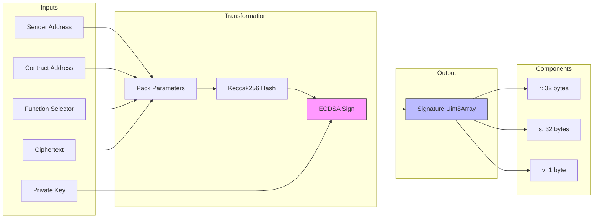

# coti-sdk-typescript 1.0.5 project - itUint256 and ctUint256 types

[This directory](../../coti-sdk-typescript/tests) contains unit and integration tests for the COTI SDK Typescript library. Below is a detailed documentation of the tests related to `itUint256` and `ctUint256` types.

## Table of Contents
- [Contract Implementation Details](#contract-implementation-details)
- [/coti-sdk-typescript type definitions](#coti-sdk-typescript-type-definitions)
    - [itUint256 (Input Text Uint256)](#ituint256-input-text-uint256)
    - [ctUint256 (Cipher Text Uint256)](#ctuint256-cipher-text-uint256)
- [Ciphertext and Signature Generation](#ciphertext-and-signature-generation)
    - [Ciphertext Generation](#ciphertext-generation)
    - [Signature Generation](#signature-generation)
    - [Process Visualized](#process-visualized)
- [SDK Comparison](#sdk-comparison)
- [itUint256 and ctUint256 Tests](#ituint256-and-ctuint256-tests)
    - [Unit Tests: tests/unit/crypto\_utils.test.ts](#unit-tests-testsunitcrypto_utilstestts)
    - [Integration Tests: tests/integration/format.compatibility.test.ts](#integration-tests-testsintegrationformatcompatibilitytestts)
- [Test Execution Report](#test-execution-report)
    - [Reproducing these Results](#reproducing-these-results)
- [Next Steps for Publishing](#next-steps-for-publishing)

## Contract Implementation Details

The operations and type definitions for `itUint256` and `ctUint256` are implemented in the `coti-contracts` repository.

### Structure Definitions
Both structures are defined in [`contracts/utils/mpc/MpcCore.sol`](contracts/utils/mpc/MpcCore.sol):
*   **`ctUint256`**: Composed of two `ctUint128` (High and Low parts).
*   **`itUint256`**: Contains the `ctUint256 ciphertext` and a `bytes[2][2] signature`.

### Operations
The logic for handling these types is implemented in the `MpcCore` library:
*   **`validateCiphertext`**: Converts `itUint256` to `gtUint256` (Garbled Text) by recursively validating the high and low 128-bit parts.
*   **Encrypted Operations**: Functions like `add`, `sub`, `onBoard`, `offBoard` for `gtUint256` are implemented starting around line 1500.

### Usage Example
A clear example of how to use these in a contract can be found in [`contracts/mocks/utils/mpc/Miscellaneous256BitTestsContract.sol`](contracts/mocks/utils/mpc/Miscellaneous256BitTestsContract.sol).

## /coti-sdk-typescript type definitions

### `itUint256` (Input Text Uint256)
Represents the input structure required for sending an encrypted 256-bit unsigned integer to a contract. It includes the split ciphertext and a signature for integrity.

```typescript
type itUint256 = {
  ciphertext: { 
    ciphertextHigh: bigint; 
    ciphertextLow: bigint 
  };
  signature: Uint8Array;
};
```

### `ctUint256` (Cipher Text Uint256)
Represents the ciphertext of a 256-bit unsigned integer, split into two 128-bit parts (High and Low) to accommodate the underlying encryption scheme.

```typescript
type ctUint256 = {
  ciphertextHigh: bigint;
  ciphertextLow: bigint;
};
```

## Ciphertext and Signature Generation

### Ciphertext Generation
**Source**: [`createCiphertext256` (Lines 482-488)](src/crypto_utils.ts#L482-L488) in `src/crypto_utils.ts`

The 256-bit integer is encrypted using a split-key AES approach, handling the value as two 128-bit blocks (High and Low).

1.  **Splitting**: The 256-bit integer is split into two 128-bit parts:
    *   **High Part**: The most significant 128 bits. (If input <= 128 bits, this is 0).
    *   **Low Part**: The least significant 128 bits.
2.  **Encryption (per 128-bit block)**: Each part is encrypted separately using AES-128 with a unique random value $r$.
    *   Generates a random 128-bit value $r$.
    *   Computes $EncryptedR = AES_{key}(r)$.
    *   Computes $Ciphertext = EncryptedR \oplus Plaintext$.
3.  **Combination**: The final ciphertext is a 64-byte array structured as:
    *   `[CiphertextHigh (16b), rHigh (16b), CiphertextLow (16b), rLow (16b)]`

### Signature Generation
**Source**: [`signIT` (Lines 426-431)](src/crypto_utils.ts#L426-L431) in `src/crypto_utils.ts`

To ensure integrity and prevent replay attacks, a signature is generated over the transaction parameters.

1.  **Packing**: The following data is packed and hashed using `keccak256`:
    *   `senderAddress` (bytes)
    *   `contractAddress` (bytes)
    *   `functionSelector` (bytes4)
    *   `ciphertext` (64 bytes, as generated above)
2.  **Signing**: The resulting hash is signed using the sender's ECDSA private key.
3.  **Result**: The signature is returned as a 65-byte `Uint8Array`.
    *   **Format**: `[...r, ...s, v]`
    *   **r**: 32 bytes (ECDSA signature component)
    *   **s**: 32 bytes (ECDSA signature component)
    *   **v**: 1 byte (Recovery identifier, 0 or 1)
    *   **Why `Uint8Array`?**: This is the standard binary data format in JavaScript/TypeScript environments, ensuring compatibility with the `bytes` type in Solidity contracts and efficient raw data handling.

### Process Visualized



## SDK Comparison

This section details the new functions added in this local version of the SDK compared to the latest published version (`@coti-io/coti-sdk-typescript@1.0.4`).

The published version supports up to 128-bit integers using `buildInputText`. The local version extends this to support 256-bit integers with a new split-key encryption scheme and introduces new named functions.

| Feature | Published Version (`1.0.4`) | Local Version (`0.5.5`+) |
| :--- | :--- | :--- |
| **Input Generation** | `buildInputText` | `buildInputText`, **`prepareIT`**, **`prepareIT256`** |
| **Max Integer Size** | 128-bit | **256-bit** |
| **Ciphertext Format** | Single `bigint` (128-bit) | `bigint` (128-bit) OR **Struct `{ high, low }`** (256-bit) |
| **Decryption** | `decryptUint` | `decryptUint`, **`decryptUint256`** |
| **New Types** | `itUint`, `ctUint` | `itUint`, `ctUint`, **`itUint256`**, **`ctUint256`** |

> [!IMPORTANT]
> **API Changes**:
> *   **`prepareIT`**: Included in the local version as an alias/alternative to `buildInputText`.
> *   **`prepareIT256`**: A completely new function required for encrypting `uint256` values (e.g., ERC20 amounts). It produces a 2-part ciphertext that must be handled differently by the contract.
> *   **`decryptUint256`**: Added to decrypt the new split-format 256-bit ciphertexts.

## `itUint256` and `ctUint256` Tests


These tests verify the functionality of 256-bit integer encryption (`prepareIT256`) and decryption (`decryptUint256`), as well as the structure of the resulting types.

### Unit Tests: [tests/unit/crypto_utils.test.ts](../../coti-sdk-typescript/tests/unit/crypto_utils.test.ts)

These tests focus on the cryptographic correctness of the `prepareIT256` and `decryptUint256` functions.

#### 1. `prepareIT256` with variable bit sizes
**Source**: [Lines 771-774](../../coti-sdk-typescript/tests/unit/crypto_utils.test.ts#L771-L774)
**Function Tested**: [`prepareIT256`](../../coti-sdk-typescript/src/crypto_utils.ts#L494)

*   **Purpose**: To verify that `prepareIT256` correctly handles plaintexts of different bit lengths.
*   **Method Executed**:
    ```typescript
    prepareIT256(
        PLAINTEXT, 
        sender, 
        contractAddress, 
        functionSelector
    )
    ```
*   **Parameters Used**:
    *   `PLAINTEXT`: `(2n ** BigInt(bitSize)) - 1n` for `bitSize` = 100, 129, 200, 255, and 256.
    *   `sender`: `{ wallet: new Wallet(TEST_PRIVATE_KEY), userKey: TEST_USER_KEY }`
    *   `contractAddress`: `'0x0000000000000000000000000000000000000001'`
    *   `functionSelector`: `'0x11223344'`
*   **Expected Results**:
    *   Returns object with `ciphertext` (`ciphertextHigh`, `ciphertextLow`) and `signature`.
    *   `ciphertextHigh` > 0n, `ciphertextLow` > 0n.
    *   `signature` is a non-empty `Uint8Array`.

#### 2. `prepareIT256` Error Handling
**Source**: [Lines 776-794](../../coti-sdk-typescript/tests/unit/crypto_utils.test.ts#L776-L794)
**Function Tested**: [`prepareIT256`](../../coti-sdk-typescript/src/crypto_utils.ts#L494)

*   **Purpose**: To ensure the function throws a `RangeError` for plaintexts larger than 256 bits.
*   **Method Executed**: `prepareIT256(PLAINTEXT, ...)`
*   **Parameters Used**:
    *   `PLAINTEXT`: `2n ** 256n` (Which is $2^{256}$, a 257-bit number).
*   **Expected Results**: Throws `RangeError` with message "Plaintext size must be 256 bits or smaller".

#### 3. Round-Trip Encryption/Decryption (`prepareIT256` -> `decryptUint256`)
**Source**: [Lines 796-799](../../coti-sdk-typescript/tests/unit/crypto_utils.test.ts#L796-L799)
**Functions Tested**: 
*   [`prepareIT256`](../../coti-sdk-typescript/src/crypto_utils.ts#L494) (Encryption)
*   [`decryptUint256`](../../coti-sdk-typescript/src/crypto_utils.ts#L286) (Decryption)

*   **Purpose**: To verify that encryption followed by decryption yields the original value.
*   **Methods Executed**:
    1.  `const { ciphertext } = prepareIT256(PLAINTEXT, sender, ...)`
    2.  `const decrypted = decryptUint256(ciphertext, USER_KEY)`
*   **Parameters Used**:
    *   `PLAINTEXT` values:
        *   `(2n ** 100n) - 12345n` (100-bit)
        *   `2n ** 128n + 12345n` (129-bit)
        *   `(2n ** 200n) - 12345n` (200-bit)
        *   `(2n ** 256n) - 1n` (256-bit)
    *   `USER_KEY`: Matching the key used in `sender` for `prepareIT256`.
*   **Expected Results**: `decrypted === PLAINTEXT` for all cases.

### Integration Tests: [tests/integration/format.compatibility.test.ts](../../coti-sdk-typescript/tests/integration/format.compatibility.test.ts)

These tests focus on the structure and format compatibility of the produced objects, ensuring they align with contract expectations (struct consistency).

#### 1. Output Structure Verification
*   **Purpose**: To validate that `prepareIT256` returns an object matching the `itUint256` TypeScript type definition.
*   **Inputs**: `plaintext` = $2^{200}$.
*   **Expected Results**:
    *   Result object has `ciphertext` and `signature` properties.
    *   `ciphertext` has `ciphertextHigh` and `ciphertextLow`.
    *   Properties have correct types (`bigint`, `Uint8Array`).

#### 2. Values Validity
*   **Purpose**: To ensure the generated BigInts are valid positive integers.
*   **Inputs**: `plaintext` = $2^{200}$.
*   **Expected Results**: `ciphertextHigh` and `ciphertextLow` are greater than 0.

#### 3. Contract Struct Compatibility
*   **Purpose**: To check if the output can be serialized into a format suitable for passing to a smart contract struct (e.g., string representation of numbers).
*   **Inputs**: `plaintext` = $2^{200}$.
*   **Expected Results**: `ciphertextHigh` and `ciphertextLow` can be successfully converted to strings.

#### 4. Hex String Conversion
*   **Purpose**: To verify that the BigInt components can be converted to Hex strings (common for Ethereum JSON-RPC interactions).
*   **Inputs**: `plaintext` = $2^{200}$.
*   **Expected Results**: `ciphertextHigh` and `ciphertextLow` convert to valid hex strings starting with `0x`.

## Test Execution Report

The following table documents the results of running the "Round-Trip Encryption/Decryption" unit tests for `prepareIT256` and `decryptUint256`.

| Test Case | Input Value (Dec) | Encrypted Sample (High, Low) | Decrypted | Result |
|---|---|---|---|---|
| 100-bit value | `0xffffffff...ffffcfc7` | High: `0xcbfabb8e...`<br>Low: `0x31032483...` | `0xffffffff...ffffcfc7` | **PASS** |
| 129-bit value | `0x10000000...00003039` | High: `0x2daa19a9...`<br>Low: `0xda3bb4a2...` | `0x10000000...00003039` | **PASS** |
| 200-bit value | `0xffffffff...ffffcfc7` | High: `0x7dcbe32e...`<br>Low: `0xd106cdb3...` | `0xffffffff...ffffcfc7` | **PASS** |
| 256-bit value | `0xffffffff...ffffffff` | High: `0x57076ee1...`<br>Low: `0x48625a01...` | `0xffffffff...ffffffff` | **PASS** |

*Note: Encrypted values change on each run due to random salt/iv.*

### Reproducing these Results

To generate these values, you can run the following script using `npx ts-node`.

1.  Create a file `generate_report.ts` in the project root:

```typescript
import { prepareIT256, decryptUint256 } from './src/crypto_utils';
import { Wallet } from 'ethers';
import dotenv from 'dotenv';
dotenv.config();

const TEST_CONSTANTS = {
    PRIVATE_KEY: process.env.TEST_PRIVATE_KEY || '0xac0974bec39a17e36ba4a6b4d238ff944bacb478cbed5efcae784d7bf4f2ff80',
    USER_KEY: process.env.TEST_USER_KEY || '00112233445566778899aabbccddeeff',
    CONTRACT_ADDRESS: '0x0000000000000000000000000000000000000001',
    FUNCTION_SELECTOR: '0x11223344'
};
const sender = { wallet: new Wallet(TEST_CONSTANTS.PRIVATE_KEY), userKey: TEST_CONSTANTS.USER_KEY };

const testValues = [
    { name: '100-bit value', val: (2n ** 100n) - 12345n },
    { name: '129-bit value', val: 2n ** 128n + 12345n },
    { name: '200-bit value', val: (2n ** 200n) - 12345n },
    { name: '256-bit value', val: (2n ** 256n) - 1n }
];

console.log('| Test Case | Input Value (Dec) | Encrypted (High, Low) | Decrypted | Result |');
console.log('|---|---|---|---|---|');

testValues.forEach(test => {
    const it = prepareIT256(test.val, sender, TEST_CONSTANTS.CONTRACT_ADDRESS, TEST_CONSTANTS.FUNCTION_SELECTOR);
    const decrypted = decryptUint256(it.ciphertext, TEST_CONSTANTS.USER_KEY);
    const result = decrypted === test.val ? 'PASS' : 'FAIL';
    
    // Format helper
    const fmt = (v: any) => '0x' + v.toString(16);
    const trunc = (s: string) => s.length > 20 ? s.slice(0, 10) + '...' + s.slice(-8) : s;

    const inputHex = fmt(test.val);
    const ctHighHex = fmt(it.ciphertext.ciphertextHigh);
    const ctLowHex = fmt(it.ciphertext.ciphertextLow);
    const decryptedHex = fmt(decrypted);

    console.log(`| ${test.name} | \`${trunc(inputHex)}\` | High: \`${trunc(ctHighHex)}\`<br>Low: \`${trunc(ctLowHex)}\` | \`${trunc(decryptedHex)}\` | ${result} |`);
});
```

2.  Run the script:

```bash
npx ts-node generate_report.ts
```

## Next Steps for Publishing

To release these changes as a new version of the `@coti-io/coti-sdk-typescript` package:

1.  **Run Tests**: Ensure all unit and integration tests pass.
    ```bash
    npm test
    ```
2.  **Increment Version**: Update the `version` field in `package.json` according to Semantic Versioning (e.g., `0.6.0` or `1.1.0` since this adds new features).
    ```bash
    npm version minor
    ```
3.  **Build**: Compile the TypeScript source code to JavaScript (outputs to `/dist`).
    ```bash
    npm run build
    ```
4.  **Publish**: Push the new version to the npm registry.
    ```bash
    npm publish --access public
    ```
    *(Ensure you are logged in via `npm login` and have permissions for the `@coti-io` organization)*.
